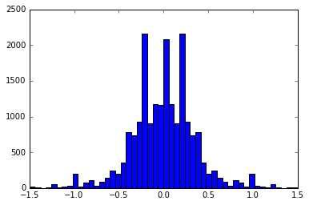

# **Behavioral Cloning** for project 3 of term1

**Behavioral Cloning Project**
The goals / steps of this project are the following:

* Use the simulator to collect data of good driving behavior
* Build, a convolution neural network in Keras that predicts steering angles from images
* Train and validate the model with a training and validation set
* Test that the model successfully drives around track one without leaving the road
* Summarize the results with a written report


## Rubric Points

Here I will consider the [rubric points](https://review.udacity.com/#!/rubrics/432/view) individually and describe how I addressed each point in my implementation.  
---

### Files Submitted & Code Quality

#### 1. Submission includes all required files and can be used to run the simulator in autonomous mode

My project includes the following files:

* model.py containing the script to create and train the model
* drive.py for driving the car in autonomous mode
* model.h5 containing a trained convolution neural network 
* README.md  summarizing the results

#### 2. Submission includes functional code 

Using the Udacity provided simulator and my drive.py file, the car can be driven autonomously around the track by executing ```python drive.py model.h5``` in the command prompt window.

#### 3. Submission code is usable and readable

The model.py file conains the code for training and saving the convolution neural network. The file shows the pipeline I used for training and validating the model, and it contains comments to explain how the code works.

### Model Architecture 

#### 1. An appropriate model architecture has been employed

My model consists of multiple layers of convolution neural network with 5x5, 3x3 filter sizes and depth of 24 and a stride of 2(model.py lines 24-32).
The model includes RELU layers to introduce nonlinearity along with every convolutution layer and dense layer, and the data is normalized in the model using a Keras lambda layer (code line 22). 

#### 2. Attempts to reduce overfitting in the model

The model contains dropout layers in order to reduce overfitting (model.py lines 29,31,33). 
The model was trained and validated on different data sets to ensure that the model was not overfitting (code line 10-16). The model was tested by running it through the simulator and ensuring that the vehicle could stay on the track.

#### 3. Model parameter tuning

The model used an adam optimizer, so the learning rate was not tuned manually (model.py line 40).

#### 4. Appropriate training data

Training data was chosen to keep the vehicle driving on the road. I used a combination of center lane driving, recovering from the left and right sides of the road. I also used some training data from patches of the road where some side lines are missing.
The next section gives more details about how I created the training data.


### Model Training Strategy

#### 1. Solution Design Approach

The overall strategy for deriving a model architecture was to be able to have a tuned model with lowest possible training data set. 
My initial attempts were to use a very deep network with several convolutional neural network layers with too many output filters. However, the model size was too high. For one such model, I got the model size upto 250Mb, yet unsatisfactory driving performance on the road.

Then, I limited my model depth to 17 layers in the final version(including lambda, dense, and dropout layers), with each convolution layer having only 24 output filters but with different convolution filter sizes. 

In order to gauge how well the model was working, I split my image data and steering angle data into a training and validation set. I found that my first model had a low mean squared error on the training set but a high mean squared error on the validation set. This implied that the model was overfitting. 

To combat the overfitting, I included three dropout layers in my network. It might be an aggressive dropout layer set each with a 0.5 dropout factor, but it worked for me.

In order to combat the problem of reducing image sizes with each convolution filter, I used same padding. As a part of each convolutional layer, I included relu activator. 

I found that the model does not perform well with the simulator yet. I then used a lambda layer to crop the images to remove sky view, and some unnecessary static views from the bottom of the image. 

This step changed the model performance in autonomous mode drastically, but did not meet my expectations. 

Then i increased the number of epochs from 10 to 20, and the performance improvement is considerable. 

At the end of every change, I was running the simulator to see how well the car was driving around track one. There were a few spots where the vehicle fell off the track. 

I realized that the input data quality has a great deal of effect on the model's training. I tried to capture fresh data with only recoveries from the sides of the roads, at turns and at places where track might not have side lines. This data is surprizingly a small set, and took only 1/4th the time it took for my earlier data set.

At the end of the process, the vehicle is able to drive autonomously around the track without leaving the road.

#### 2. Final Model Architecture

Below is a visualization of the architecture


#### 3. Creation of the Training Set & Training Process

To capture good recovery behavior, I recorded recovery conditions on track one at different instances.
These images show what a recovery looks like starting from right to center:


To augment the data sat, I also flipped images and angles thinking that this would increase increase the number of training data points. For example, here is an image that has then been flipped:


Additionally, the images with more steering angles are used for data sugumentation. Some images are blurred, some images are shifted in X direction (lines 105 to 182).

After the collection process, I had 19886 data points from an original 5610 number of data points. I then preprocessed this data by normalizing first and then cropping.

Distribution of the data points before and after data augumentation is below




I finally randomly shuffled the data set and put 20% of the data into a validation set. 

I used this training data for training the model. The validation set helped determine if the model was over or under fitting. The ideal number of epochs was 20 as evidenced by the outcome. I used an adam optimizer so that manually training the learning rate wasn't necessary.

### Result

The model has been able to successfully run the car in the simulator in autonomous environment. I have tested the model with simulator on track 1 with different resolutions and it worked equally well. 


